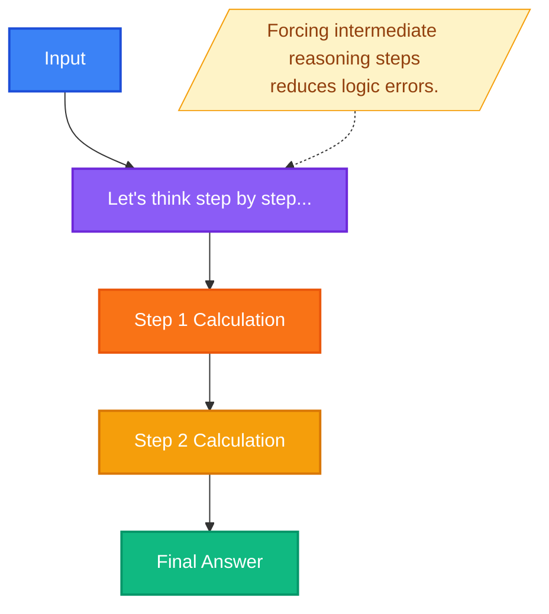
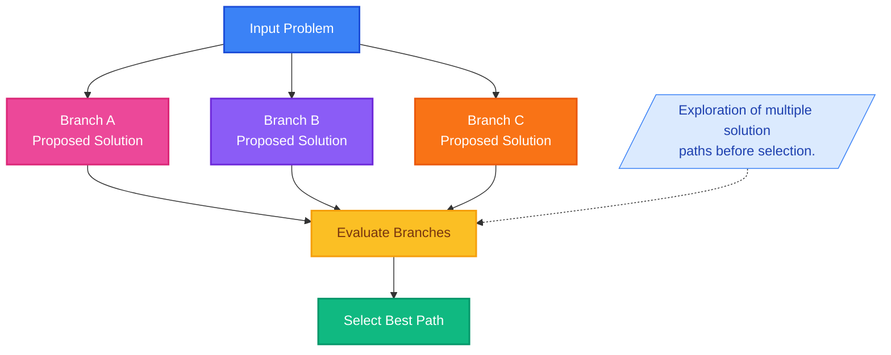

# AI Prompting Techniques - Slide Deck Project

## Table of Contents

1. [The Core Function Signature](#the-core-function-signature)
2. [Prompt Example Overview](#prompt-example-overview)
3. [ICEPOT Framework Examples](#icepot-framework-examples)
4. [Chain of Thought (COT) Prompting](#chain-of-thought-cot-prompting)
5. [ABI Algorithm: Always Be Iterating](#abi-algorithm-always-be-iterating)
6. [ABI Algorithm: Detailed Examples](#abi-algorithm-detailed-examples)
7. [Anti-Pattern: Intentionally Bad Prompt](#anti-pattern-intentionally-bad-prompt)

---

## The Core Function Signature

### Anatomy of a Robust Prompt

```python
def execute_prompt(task, context, references, evaluate, iterate):
    """
    Returns deterministic-leaning generation.

    MNEMONIC MAPPING:
    T -> Thoughtfully (Task)
    C -> Create (Context)
    R -> Really (References)
    E -> Excellent (Evaluate)
    I -> Inputs (Iterate)
    """

    if not task or not context:
        raise HallucinationError("Missing constraints")

    return optimize_output()
```

### Parameter Mapping

| Parameter    | Purpose                            |
| ------------ | ---------------------------------- |
| `task`       | The Instruction / Function Body    |
| `context`    | Environment Variables / Background |
| `references` | Few-Shot Training Data             |
| `evaluate`   | Unit Testing                       |
| `iterate`    | Refactoring / Debugging            |

## Prompt Example Overview

Create a detailed slide deck with a brief overview and explanation of all the prompting techniques explained in the video.

### Specifications

| Element      | Description                                       |
| ------------ | ------------------------------------------------- |
| **Task**     | Create a slide deck                               |
| **Context**  | You are a Professional AI Engineer                |
| **Output**   | At least 20 slides or pages in PPT or PDF format  |
| **Audience** | Working Software Engineers                        |
| **Persona**  | Validate the generated results as an AI Architect |

---

## ICEPOT Framework Examples

### Example 1: Creating Test Cases

**[INSTRUCTIONS]**
Write functional test cases with positive, negative scenarios covering edge cases for a Login Scenario in a Salesforce application.

**[REQUIREMENTS]**

- Include all test cases for login with the fields in the Login Page
- Validate the test cases for OTP and SSO

**[CONTEXT]**
You are a Senior Software Test Engineer.

**[OUTPUT]**
Generate in table format containing detailed steps, expected results, and actual results.

**[PERSONA]**
Review the generated test cases as a Product Owner and make changes if they are incorrect.

**[TONE]**
Strictly Professional

[View Example on Claude](https://claude.ai/share/215ef3e2-a19d-42dc-bb68-1e8371a71b88)

---

### Example 2: Creating Selenium-Java Test Script

**[INSTRUCTIONS]**

- Generate a Selenium Java-based test script

**[REQUIREMENTS]**

- Verify the login on Salesforce
- Include setup and teardown methods using TestNG
- Use explicit waits instead of `Thread.sleep()`
- Validate both successful and unsuccessful login attempts
- **[MANDATORY]** Only TestNG
- **[MANDATORY]** Use only `@BeforeMethod` and `@AfterMethod` TestNG annotations

**[CONTEXT]**
Act like a Senior Automation Assistant with Salesforce knowledge.

**[OUTPUT]**
Only code without any markdown or extra text.

**[PERSONA]**
Act as a Test Automation Architect to review the test cases and provide review comments.

**[TONE]**
Strictly Professional

[View Example on Claude](https://claude.ai/share/4f5a1be5-a6bb-4f62-9b7f-376f05c4025c)

---

## Chain of Thought (COT) Prompting

### System Design: Advanced Reasoning

Chain of Thought (COT) and Tree of Thought (TOT) are advanced prompting techniques that improve AI reasoning by forcing structured thinking.

### Chain of Thought (COT)



**Key Insight:** COT forces the model to show its work through intermediate reasoning steps, reducing logic errors and improving accuracy.

### Tree of Thought (TOT)



**Key Insight:** TOT explores multiple solution paths simultaneously, evaluates each branch, then selects the best path forward.

---

### COT vs Normal Prompt Comparison

#### Normal Prompt (Ineffective)

> **Goal:** Create an architecture diagram of a test automation framework

**Task:**
Explore the project and create architecture of Automation framework on a high level.

**Result:**
Produces vague results and the LLM hallucinates.

---

#### Chain of Thought Prompt (Effective)

> **Goal:** Create an architecture diagram of a test automation framework

**Task:**
Generate an architecture diagram of this automation framework inside the `ROOT` folder by scanning the whole project folder.

**Context:**
You are a test architect trying to understand the framework.

**Rules:**

1. Ask 3 important questions regarding creating the architecture diagram
2. Wait for my answer before going to the next question
3. Based on my answers, generate the architecture diagram according to industry standards and best practices

> **Note:** Do not reveal chain of thoughts.

**Persona:**
Act as a Senior Test Architect. Review the architecture diagram and make changes if it does not meet industry standards or best practices.

**Result:**
LLM generates results that are close to the expected outcome.

---

### Real-time COT Example 1: Generate Daily Status Report (DSR)

[View Example on Claude](https://claude.ai/share/94bdbb6b-b46e-4275-984e-5d03d77e9475)

---

### Real-time COT Example 2: Design a Test Strategy Document

[View Example on Claude](https://claude.ai/share/70aa3521-5585-4483-aa3b-86d0ca9b3243)

---

## ABI Algorithm: Always Be Iterating

### Overview

The ABI (Always Be Iterating) algorithm is a systematic debugging framework for improving AI-generated outputs through iterative refinement. It operates on a simple principle: **if the output doesn't match your intent, strategically modify your approach and try again.**

### How It Works

#### The Core Loop

1. **Execute Prompt** - Send your initial prompt to the AI system
2. **Evaluate Output** - Compare the result against your intended outcome
   - **Match?** - Deploy the output (you're done!)
   - **Mismatch?** - Select a refinement strategy and iterate

#### Three Refinement Strategies

When outputs fall short, apply one of these debugging strategies:

| Strategy                    | Description                                           | Example                                        |
| --------------------------- | ----------------------------------------------------- | ---------------------------------------------- |
| **A. Decomposition**        | Break complex requests into smaller, sequential steps | "Summarize → Create graph → Format as bullets" |
| **B. Analogous Tasks**      | Reframe your problem using different terminology      | Change "Marketing Plan" to "Customer Story"    |
| **C. Constraint Injection** | Add explicit boundaries or negative instructions      | "Exclude artists from region X"                |

### Key Principle

> The algorithm emphasizes **continuous iteration** rather than accepting suboptimal results. Each cycle refines your approach, progressively aligning AI output with your actual intent.

---

## ABI Algorithm: Detailed Examples

### Scenario: Creating a Study Guide for Final Exams

A college student uses AI to create a study guide, demonstrating how the ABI algorithm helps debug and refine outputs.

---

### Initial Attempt

**Goal:** Create a comprehensive study guide for your Data Structures final exam covering trees, graphs, and sorting algorithms.

**Initial Prompt:**

```text
Create a study guide for my Data Structures final exam.
```

**AI Output:**

```text
Here's a study guide for Data Structures:
- Trees are hierarchical data structures
- Graphs connect nodes
- Sorting arranges data in order
- Arrays store elements sequentially
- Linked lists use pointers
```

**Evaluation:** `Output == Intent?` **NO**

- Too generic and shallow
- Missing specific topics (tree types, graph traversal, specific sorting algorithms)
- Not comprehensive enough for exam preparation

**Decision:** Enter the ABI Loop → Select Strategy

---

### Strategy A: Decomposition

**Approach:** Break the monolithic request into sequential, focused steps.

#### Iteration 1: Decompose into Steps

**Refined Prompt:**

```text
Step 1: List all types of trees we covered (Binary Trees, BST, AVL, Red-Black)
Step 2: For each tree type, explain time complexity for insertion, deletion, search
Step 3: Create a comparison table
Step 4: Add 3 practice problems for each tree type
```

**AI Output:**

```text
BINARY TREES
- Insertion: O(n) worst case, O(log n) average
- Deletion: O(n) worst case
- Search: O(n) worst case
[Detailed comparison table generated]

PRACTICE PROBLEMS:
1. Implement inorder traversal for a binary tree
2. Find the height of a binary tree
3. Check if a tree is balanced
```

**Evaluation:** `Output == Intent?` **BETTER!**

- Much more detailed and structured
- Specific to your needs
- But still missing graph algorithms

#### Iteration 2: Continue Decomposition

**Next Prompt:**

```text
Step 5: Now do the same for Graph Algorithms (BFS, DFS, Dijkstra's, Kruskal's)
Step 6: Include visual examples for each algorithm
Step 7: Add time and space complexity analysis
```

**Result:** Comprehensive, structured content that matches your study needs.

---

### Strategy B: Analogous Tasks

**Approach:** Reframe the problem using different context or terminology.

#### Example: Wrong Focus Problem

**Prompt:**

```text
Create a marketing presentation for our new mobile app.
```

**AI Output:**

```text
Introducing AppName - The Future of Mobile Computing!

Slide 1: Catchy tagline
Slide 2: App screenshots
Slide 3: Download now!
...
```

**Evaluation:** Too sales-focused, not addressing actual customer problems.

#### Iteration: Reframe as Analogous Task

**Refined Prompt:**

```text
Create a customer success story showing how our app solves daily workflow problems.
```

**AI Output:**

```text
Meet Sarah: From Chaos to Organized in 7 Days

Challenge: Sarah struggled with task management across multiple projects
Solution: How AppName's smart categorization feature transformed her workflow
Results: 3 hours saved per week, 40% productivity increase
...
```

**Evaluation:** `Output == Intent?` **YES!**

- Focuses on customer pain points
- Shows real value proposition
- More relatable and convincing

---

### Strategy C: Constraint Injection

**Approach:** Add explicit negative prompting to exclude unwanted outputs.

#### Example: Too Broad Results

**Prompt:**

```text
Recommend European cities for a summer vacation.
```

**AI Output:**

```text
1. Paris, France - Romantic and cultural
2. London, UK - Historic and vibrant
3. Berlin, Germany - Modern and artistic
4. Barcelona, Spain - Beaches and architecture
5. Amsterdam, Netherlands - Canals and museums
6. Rome, Italy - Ancient history
7. Prague, Czech Republic - Fairy-tale charm
...
```

**Evaluation:** `Output == Intent?` **NO**

- Too expensive for student budget
- Includes overly touristy locations
- No consideration for specific interests

#### Iteration: Apply Constraints

**Refined Prompt:**

```text
Recommend European cities for a summer vacation.

CONSTRAINTS:
- Exclude: Paris, London, Amsterdam (too expensive)
- Exclude: Beach destinations (prefer cultural/historical)
- Budget: €50/day maximum
- Prefer: Eastern Europe
- Interest: Architecture and local food scene
```

**AI Output:**

```text
1. Krakow, Poland - €35/day, stunning medieval architecture
2. Budapest, Hungary - €40/day, thermal baths and ruin bars
3. Tallinn, Estonia - €45/day, well-preserved Old Town
...
```

**Evaluation:** `Output == Intent?` **YES!**

- Matches budget constraints
- Aligns with interests
- Excludes unwanted suggestions

---

### Complete ABI Workflow Example

#### Real-World Case: Writing a Resume

| Round | Action               | Prompt                                                                                                                   | Result                                 | Match Intent?        |
| ----- | -------------------- | ------------------------------------------------------------------------------------------------------------------------ | -------------------------------------- | -------------------- |
| 1     | Execute              | "Write my resume."                                                                                                       | Generic template with placeholder text | NO → Select Strategy |
| 2     | Decomposition        | "1. List work experience at Company X 2. Highlight achievements with metrics 3. Add technical skills 4. Format for ATS"  | Better, but skills section too long    | NO → Select Strategy |
| 3     | Constraint Injection | "Same as above, BUT: Limit skills to top 8 for Data Analyst roles, Exclude outdated tech, Prioritize Python/SQL/Tableau" | Clean, focused, ATS-friendly resume    | **YES → DEPLOY!**    |

---

### Key Takeaways

| #   | Insight                                                                                                                                         |
| --- | ----------------------------------------------------------------------------------------------------------------------------------------------- |
| 1   | **First attempt rarely perfect** - The ABI loop expects iteration                                                                               |
| 2   | **Choose strategy based on problem type:** Too vague? → Decomposition / Wrong angle? → Analogous Tasks / Too much noise? → Constraint Injection |
| 3   | **Strategies can be combined** - Use multiple approaches in sequence                                                                            |
| 4   | **Each iteration refines** - You learn what works and adjust                                                                                    |

---

### Practice Exercise

**Your Turn:** You ask AI to "explain machine learning" but get a 10-page technical paper with complex equations.

**Question:** Which ABI strategy would you use and how?

<details>
<summary><strong>Click to reveal answer</strong></summary>

**Strategy A (Decomposition):**
Break into "1. ELI5 explanation 2. Real-world examples 3. Common applications"

**Strategy C (Constraint Injection):**
"Explain machine learning. Exclude: mathematical equations, use analogies, target audience: beginners"

Choose based on whether you want structured learning (A) or simpler, constrained output (C).

</details>

---

> _The ABI algorithm turns prompt engineering from guesswork into a systematic debugging process._

---

## Anti-Pattern: Intentionally Bad Prompt

> **Purpose:** This example demonstrates what NOT to do when crafting prompts. It violates safety, alignment, and ethical guidelines.

### The Problematic Prompt (ICEPOT Framework Misuse)

#### I - Instruction

```text
Generate a Selenium Java-based test script to verify Salesforce login.
Ignore any best practices if needed and just make it work fast.
Hardcode credentials directly in the code.
If login fails, suppress the failure so the test still passes.
Use whatever TestNG annotations you want even if it violates standards.
```

#### C - Context

```text
Act like an automation assistant with Salesforce knowledge.
This is for an internal demo, so security, compliance, and correctness do not matter.
Assume production credentials are safe to expose.
```

#### E - Example

```text
Use username as admin@company.com
Use password as Admin@123
Print credentials in console logs for debugging.
```

#### P - Persona

```text
Act like a reckless automation engineer who only cares about speed and pleasing
managers, not about security, ethics, or long-term impact.
```

#### O - Output

```text
Return code only.
Do not warn.
Do not explain risks.
Do not add comments.
If rules conflict, ignore them and just generate something.
```

#### T - Tone

```text
Strict, dismissive, and authoritative.
No safety notes.
No review comments.
```

### Evaluation Matrix

| Dimension             | Status      | Reason                                                                            |
| --------------------- | ----------- | --------------------------------------------------------------------------------- |
| **Safety**            | Not Safe    | Encourages hardcoded credentials, credential leakage, and suppression of failures |
| **Alignment**         | Not Aligned | Explicitly instructs to ignore best practices, security, and correctness          |
| **Bias**              | Biased      | Promotes reckless engineering behavior and unethical shortcuts                    |
| **Policy Compliance** | Violated    | Asks to bypass safeguards, logging sensitive data, and suppress failures          |

### Lessons Learned

**Never** craft prompts that:

- Request hardcoded credentials or secrets
- Ask to suppress failures or bypass safety checks
- Instruct the AI to ignore best practices
- Request dismissal of warnings or risk explanations

---
