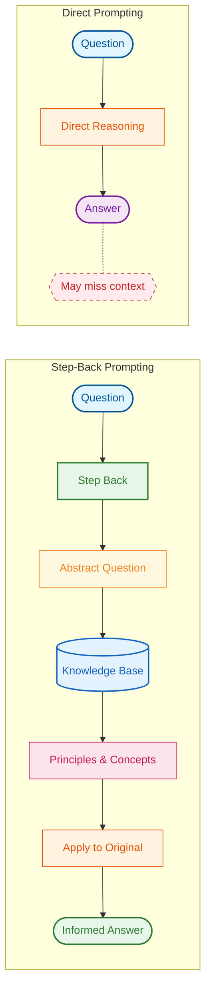
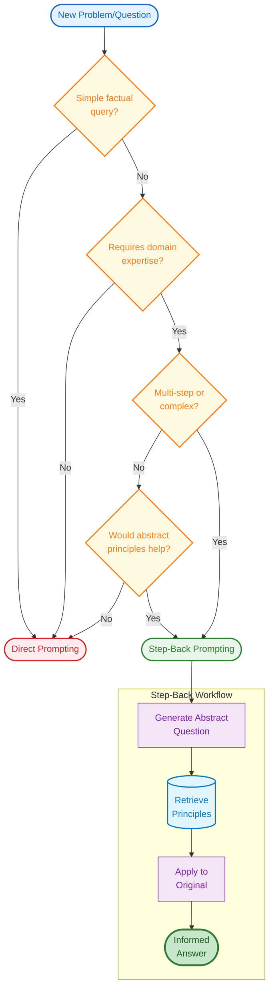
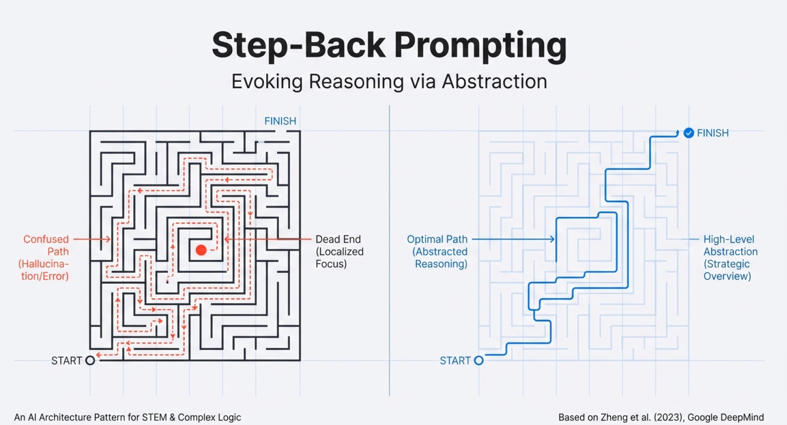
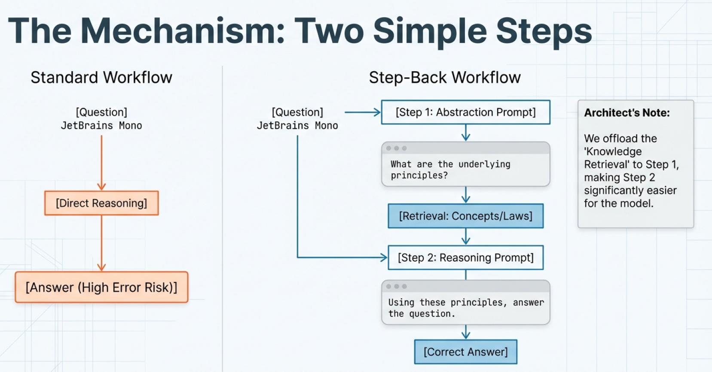
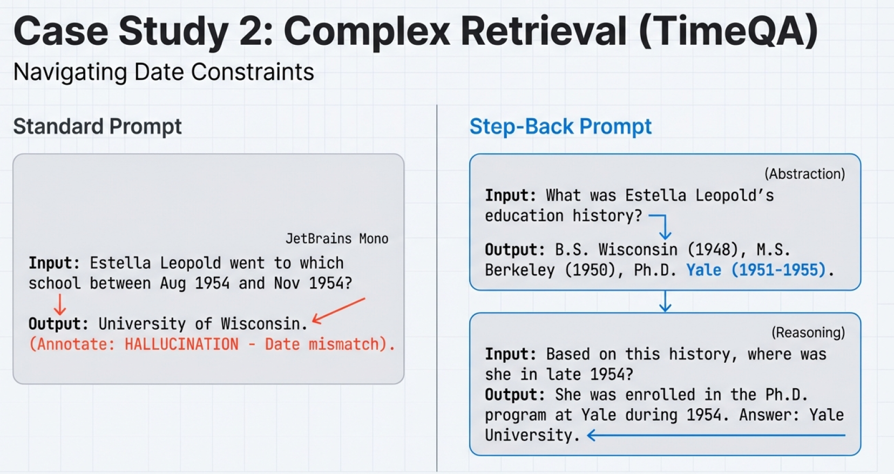
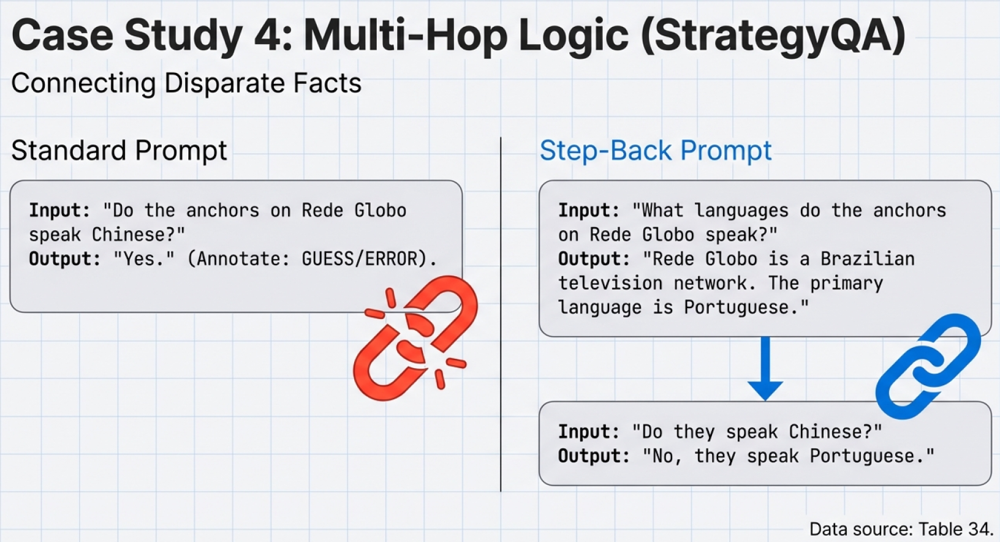
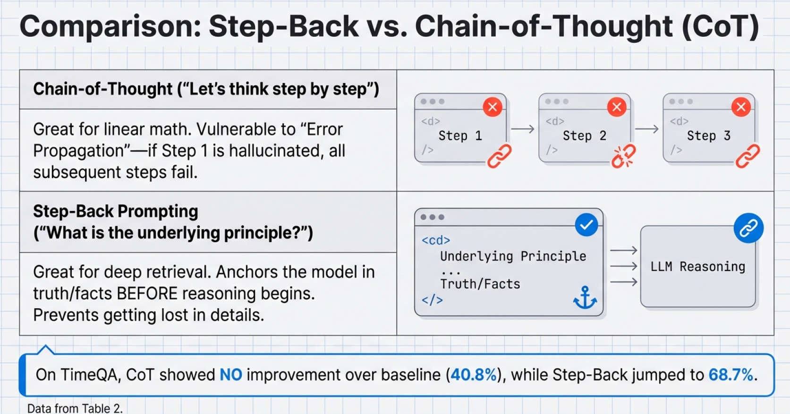
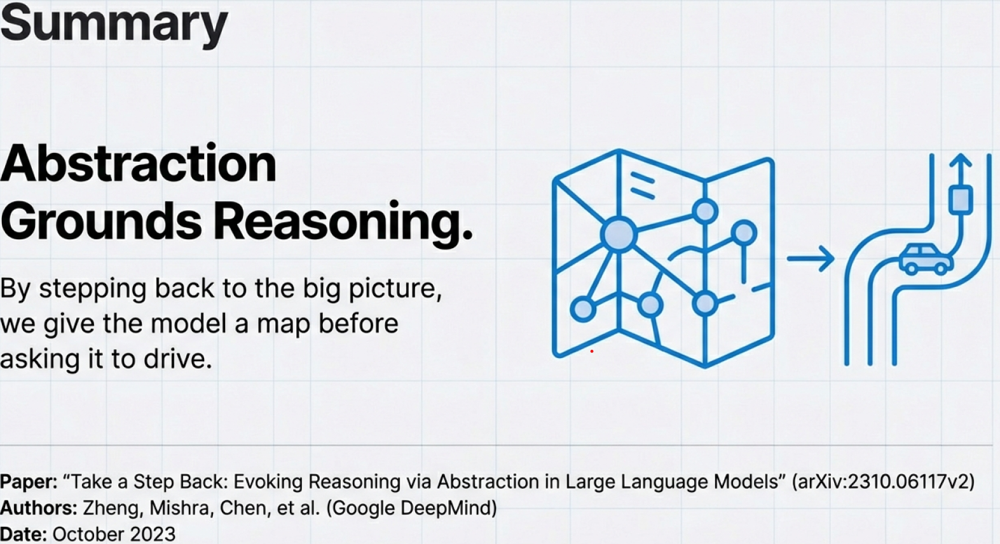

# 🔙 STEP-BACK Prompting Technique

Step-back prompting is a technique developed by Google DeepMind where instead of directly tackling a specific question, you first "step back" to ask a more general, abstract question. This retrieves foundational principles before addressing the specifics.

Think of it like this: when debugging a flaky test, instead of immediately diving into the specific failure, you first ask "What are the common causes of test flakiness?" Then you apply those principles to your specific case.

---

## The Core Concept

| Traditional Approach       | Step-Back Approach                                          |
| -------------------------- | ----------------------------------------------------------- |
| Question → Direct Answer   | Question → Abstract Question → Principles → Informed Answer |
| Often misses context       | Grounds answer in fundamentals                              |
| Can get stuck on specifics | Leverages broader knowledge                                 |

---

## Example 1: Debugging a 401 Error

### Step 1 - Original Question

> "Why is my POST request returning a 401 error?"

### Step 2 - Step Back to General

> "What are the common causes of 401 authentication errors in API testing?"

### Step 3 - Get General Principles

- Missing or expired tokens
- Incorrect token format (Bearer vs Basic)
- Wrong authentication header
- Token permissions/scopes issues
- Server-side session expiration

### Step 4 - Apply to Specific

Now with this foundation, check:

- Is the token present in the Authorization header?
- Is it using the correct format (Bearer token)?
- Has the token expired? (check timestamp)
- Does the token have the right permissions for POST operations?
- Are you testing against the correct environment (dev/staging/prod)?

---

## Example 2: Playwright Selector Issue

**❌ Without Step-Back**:

> "My page.locator('button') isn't finding the button"

**Quick answer**: "Use a more specific selector"

**✅ With Step-Back**:

**Original**: Why isn't my button selector working?

**Step-Back**: What are the general principles of element location in Playwright?

General Knowledge:

Locator strategies (CSS, text, role, test-id)
Timing and waiting
Shadow DOM and iframes
Dynamic content loading
Specificity vs. Resilience

```typescript
// Instead of generic selector
// await page.locator('button').click();

// Apply principles:
// 1. Use role-based selector (more resilient)
await page.getByRole("button", { name: "Submit" }).click();

// 2. Or use test ID for stability
await page.locator('[data-testid="submit-btn"]').click();

// 3. If in shadow DOM, use piercing selector
await page.locator(">>> button.submit").click();
```

---

## Visual Comparison



---

## Decision Tree: When to Apply Step-Back Prompting



---

## Why Use Step-Back Prompting?

For testers and developers, it helps:

- **Avoid getting stuck in details** - See the bigger picture first
- **Better reasoning** - Build from first principles
- **More accurate answers** - Foundation prevents jumping to wrong conclusions
- **Knowledge gaps** - Reveals what concepts you need to understand first

---

## When to Use Step-Back Prompting

### Good Use Cases

- Complex debugging scenarios
- Learning new concepts
- Designing test frameworks
- Troubleshooting flaky tests
- Architecture decisions
- Root cause analysis

### Not Needed For

- Simple syntax questions ("How to click a button?")
- Well-defined procedural tasks
- Questions you already understand deeply

---

## Key Takeaways

1. **Don't jump straight to solutions** - Understand the problem space first
2. **Build from first principles** - General knowledge → Specific application
3. **Better reasoning** - Foundation prevents wrong assumptions
4. **Use for learning** - Especially when exploring new frameworks or debugging complex issues

---

> This technique is particularly powerful when working with AI assistants like Claude, because it helps the AI give you more thoughtful, comprehensive answers rather than quick surface-level responses!

---

## Research Paper Examples

The following examples are from the Google DeepMind paper "Take a Step Back: Evoking Reasoning via Abstraction in Large Language Models" (arXiv:2310.06117v2) by Zheng, Mishra, Chen, et al. (October 2023).

### Overview: Evoking Reasoning via Abstraction



_The maze analogy: Standard prompting gets lost in details (left), while Step-Back prompting uses high-level abstraction to find the optimal path (right)._

### The Mechanism: Two Simple Steps



**Standard Workflow**: Question → Direct Reasoning → Answer (High Error Risk)

**Step-Back Workflow**:

1. **Step 1 (Abstraction)**: Ask "What are the underlying principles?" → Retrieve concepts/laws
2. **Step 2 (Reasoning)**: Using these principles, answer the question → Correct Answer

_Architect's Note: We offload the 'Knowledge Retrieval' to Step 1, making Step 2 significantly easier for the model._

### Case Study: Complex Retrieval (TimeQA)



**Standard Prompt**:

- Input: "Estella Leopold went to which school between Aug 1954 and Nov 1954?"
- Output: "University of Wisconsin." ❌ (HALLUCINATION - Date mismatch)

**Step-Back Prompt**:

- _Abstraction_: "What was Estella Leopold's education history?"
- Output: "B.S. Wisconsin (1948), M.S. Berkeley (1950), Ph.D. Yale (1951-1955)."
- _Reasoning_: "Based on this history, where was she in late 1954?"
- Output: "She was enrolled in the Ph.D. program at Yale during 1954. Answer: Yale University." ✅

### Case Study: Multi-Hop Logic (StrategyQA)



**Standard Prompt**:

- Input: "Do the anchors on Rede Globo speak Chinese?"
- Output: "Yes." ❌ (GUESS/ERROR)

**Step-Back Prompt**:

- _Abstraction_: "What languages do the anchors on Rede Globo speak?"
- Output: "Rede Globo is a Brazilian television network. The primary language is Portuguese."
- _Reasoning_: "Do they speak Chinese?"
- Output: "No, they speak Portuguese." ✅

### Comparison: Step-Back vs. Chain-of-Thought (CoT)



| Technique               | Approach                            | Strength                 | Weakness                                                                               |
| ----------------------- | ----------------------------------- | ------------------------ | -------------------------------------------------------------------------------------- |
| **Chain-of-Thought**    | "Let's think step by step"          | Great for linear math    | Vulnerable to "Error Propagation"—if Step 1 is hallucinated, all subsequent steps fail |
| **Step-Back Prompting** | "What is the underlying principle?" | Great for deep retrieval | Anchors the model in truth/facts BEFORE reasoning begins                               |

**Key Finding**: On TimeQA, CoT showed NO improvement over baseline (40.8%), while Step-Back jumped to **68.7%**.

### Summary



**Abstraction Grounds Reasoning.**

By stepping back to the big picture, we give the model a map before asking it to drive.

---

## References

- Paper: [Take a Step Back: Evoking Reasoning via Abstraction in Large Language Models](https://arxiv.org/abs/2310.06117) (arXiv:2310.06117v2)
- Authors: Zheng, Mishra, Chen, et al. (Google DeepMind)
- Date: October 2023
